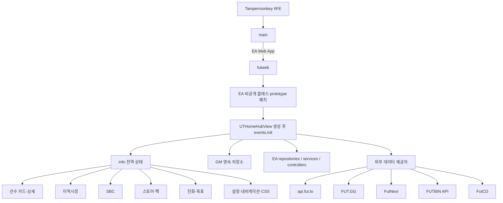
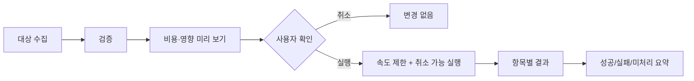

# FSU EAFC FUT Web Enhancer 26.09 분석 및 개선 설계 기준서

> 기준 소스: `fsu-eafc-fut-web.user.js` / 버전 `26.09`

## 1. 분석 목적과 결론

이 문서는 GreasyFork의 `【FSU】EAFC FUT WEB 增强器` 버전 26.09를 FC26용 Tampermonkey 확장의 현재 기준선으로 분석한 결과다.

핵심 결론은 다음과 같다.

1. 이 코드는 독립적인 브라우저 확장 프로그램이 아니라, EA FC Web App의 비공개 전역 객체와 `prototype`을 런타임에 바꾸는 대형 단일 userscript다.
2. 제공 기능은 선수 카드 보강, 가격 조회, 이적시장, SBC, 팩/스토어, 목표, 진화, 설정과 내비게이션까지 Web App 전 영역을 포괄한다.
3. 기능 폭은 넓지만 `events`, `info`, `call`이라는 전역 가변 객체에 책임이 집중되어 있다. 개별 기능의 활성화, 준비 상태, 실패 격리, 해제가 구조적으로 어렵다.
4. 현재 코드에 존재하더라도 자동 구매와 FUT.GG 페이지 연동처럼 명시적으로 차단된 기능, 선언만 되고 소비되지 않는 설정, 호출 흔적이 없는 함수가 있다.
5. 개선 작업은 기능 추가보다 먼저 안전 경계, 네트워크와 비동기 처리, 후킹 수명주기, 상태 스키마를 정리해야 한다.

## 2. 분석 범위와 검증 방법

### 원본 기준

- GreasyFork 코드: <https://greasyfork.org/en/scripts/431044-fsu-eafc-fut-web-%E5%A2%9E%E5%BC%BA%E5%99%A8/code>
- GreasyFork 설명: <https://greasyfork.org/en/scripts/431044-fsu-eafc-fut-web-%E5%A2%9E%E5%BC%BA%E5%99%A8>
- GreasyFork 버전 이력: <https://greasyfork.org/en/scripts/431044-fsu-eafc-fut-web-%E5%A2%9E%E5%BC%BA%E5%99%A8/versions>
- 로컬 원본 스냅샷: `fsu-eafc-fut-web.user.js`
- 확인 버전: `26.09`
- 로컬 파일 SHA-256: `A2E0BEB018921CDD334D68BD4AF9BEE843F9F391A98E01E3B27D67E74D6B9634`
- 코드 길이: 15,734행, 약 846KB

### 수행한 검증

- Acorn으로 전체 JavaScript 구문 분석 성공
- AST 기준 함수 1,074개, `async` 함수 90개 확인
- `events.*`에 할당된 함수 147개 확인
- 커스텀 컨트롤러를 제외한 호스트 `prototype` 패치 대상은 105개로 집계
- `GM_xmlhttpRequest` 15곳, `fetch` 1곳, `GM_getValue` 13곳, `GM_setValue` 16곳 확인
- 메타데이터, 실제 진입점, 기능 호출부, 설정 소비부, 외부 통신, 영속화 키를 교차 확인

함수와 후킹 수는 AST 모양을 기준으로 한 정적 집계다. EA 계정이 필요한 실제 Web App 런타임 회귀 테스트는 이 분석 범위에 포함되지 않았다.

## 3. 실행 진입점과 현재 활성 범위

메타데이터에는 EA Web App 외에도 EasySBC, FUTBIN, FUT.GG가 `@match`로 등록되어 있다(`1~12행`). 그러나 실제 `main()`은 다음과 같이 동작한다(`15723~15732행`).

- URL에 `ultimate-team/web-app`이 있으면 `futweb()` 실행
- FUT.GG에서는 감지 로그만 남기고 `futgg()` 호출은 주석 처리
- 모든 매치 사이트에 Lodash `_`를 `unsafeWindow._`로 노출
- EasySBC와 FUTBIN에는 별도 기능 진입점이 없음

따라서 현재 제공 범위는 다음처럼 구분해야 한다.

| 범위 | 상태 | 판정 |
|---|---|---|
| EA FC26 FUT Web App | 활성 | 전체 기능의 실질 실행 대상 |
| FUT.GG 페이지 연동 | 중지 | 함수는 있으나 진입점이 주석 처리됨 |
| FUT.GG 기반 일부 카드 메타 표시 | 중지 | 조건문에 `&& false`가 들어 있음 |
| EasySBC 페이지 | 비활성 | 매치만 있고 실행 로직 없음 |
| FUTBIN 페이지 | 비활성 | 매치만 있고 실행 로직 없음 |
| 자동 구매 허브 | 비활성/미완성 | 후킹 함수 안에서 원본 호출 직후 `return` |

버전 26.09 변경 이력의 “FUTGG 플러그인 내용 임시 숨김”과도 일치한다.

## 4. 현재 시스템 구조

### 4.1 상위 구조



### 4.2 핵심 전역 네임스페이스

`45행`에서 다음 객체들을 한 번에 만든다.

| 객체 | 현재 책임 | 구조적 문제 |
|---|---|---|
| `events` | 서비스, 알고리즘, UI 생성, 명령 실행, 네트워크, 내비게이션 | 147개 함수가 모인 God Object |
| `info` | 세션, 설정, 캐시, 진행 상태, 원격 데이터, 화면 상태 | 스키마 없는 전역 가변 저장소 |
| `cntlr` | 현재/좌/우 EA 컨트롤러 탐색 | 내부 컨트롤러 계층에 강결합 |
| `html` | HTML 조각 | 문자열 삽입과 escaping 책임 불명확 |
| `call` | 패치 전 EA 원본 메서드 보관 | 원본 보관 방식이 일관되지 않음 |
| `set` | 사용자 설정 영속화 | 버전·마이그레이션 없음 |
| `lock` | 잠근 선수 ID 저장 | 시즌별 키를 사용하나 타입 계약 없음 |
| `build` | SBC 빌더 설정 | 선언과 실제 사용 필드가 불일치 |
| `SBCCount` | 일일 SBC 완료 수 | UI와 명령 로직이 결합 |
| `futbinId` | FUTBIN ID 매핑 캐시 | 시즌 구분이 없는 영속 키 |
| `pdb` | 경매 결과 텍스트 캐시 | 수명주기와 무효화 규칙 불명확 |

### 4.3 초기화 수명주기

실질 초기화는 `events.init()`(`262행`)에서 일어난다.

1. `set`, `build`, `lock`, `SBCCount`, `futbinId` 초기화
2. 팩 정렬, SBC 내비게이션, 일일 SBC 수 등 UI 상태 복원
3. EA 인증 세션의 `utasSession.id`를 `info.base.sId`에 저장
4. 플랫폼, 연도, 새 아이템 최대 수, 경매 용량을 설정
5. `api.fut.to/26`의 버전/설정 JSON을 받아 추가 JSON을 연쇄 요청
6. 선수 캐시, 목표, SBC, 스토어 팩, 진화 과제를 로드
7. 이후 각 패치된 렌더러가 `info`를 읽어 UI를 덧붙임

`UTHomeHubView.prototype._generate`에서 클릭 실드가 사라진 뒤 초기화하며, 새로고침 타일에서도 다시 호출할 수 있다(`6787~6844행`). 하지만 다음이 없다.

- 단일 초기화 Promise
- `idle → loading → ready → failed` 상태
- 중복 호출 방지
- 원격 데이터별 readiness
- 중단/취소
- 부분 실패 격리

그 결과 카드 렌더링이 `fgconfig`만 확인하고 독립적으로 로드되는 `GGRRAR` 또는 `playermeta`를 먼저 읽는 등의 레이스가 발생할 수 있다.

### 4.4 후킹 모델

기본 패턴은 다음과 같다.

1. `call.*` 또는 로컬 상수에 EA 원본 메서드를 보관
2. `Class.prototype.method = function (...) { ... }`로 교체
3. 원본을 호출
4. DOM, ViewModel, Repository 결과에 FSU 동작을 삽입

패치 대상은 선수 카드, 아이템 상세, 검색, 스쿼드, SBC, 이적시장, 스토어, 목표, 진화, 설정, 내비게이션 등 사실상 전 화면에 걸친다.

현재 모델의 문제는 다음과 같다.

- EA 내부 클래스 하나가 이름 변경되거나 로드되지 않으면 등록 단계 전체가 중단될 수 있음
- 패치 성공 여부와 요구 capability를 기록하지 않음
- 같은 패치를 중복 적용하는지 검사하지 않음
- 기능을 끌 때 원상 복구하는 disposer가 없음
- 원본 저장 방식이 `call.*`, 로컬 상수, 완전 대체로 혼재
- 기능 하나의 예외가 EA 원본 UI 경로로 전파될 수 있음

### 4.5 기능별 대표 호스트 후크

105개 패치를 전부 기능 API로 보기는 어렵다. 상당수는 같은 기능을 여러 화면에 삽입하기 위한 UI 접점이다. 대표적인 결합 지점은 다음과 같다.

| 기능군 | 대표 EA 클래스/메서드 | 삽입 목적 |
|---|---|---|
| 선수 카드 | `UTPlayerItemView.renderItem` | 가격, 메타, 상태, 진화 배지 |
| 선수 상세 | `UTPlayerBioView.render` | 역할, FG 평가, 진화, 외부 링크 |
| 목록 | `UTSectionedItemListView.addItems`, `UTPaginatedItemListView.renderItems` | 일괄 가격과 카드 보강 |
| 클럽 검색 | `UTClubSearchFiltersViewController.viewDidAppear`, `requestItems` | 필터, 후보 정렬, 자동 채우기 |
| 스쿼드 | `UTSquadEntity.setPlayers`, `swapPlayersByIndex`, `addItemToSlot` | 변경 이력, 케미스트리, 요구 조건 |
| SBC | `UTSBCHubView.populateTiles`, `UTSBCSquadOverviewViewController._submitChallenge` | 과제 표시, 빠른 제출, 중복 처리 |
| 이적시장 | `UTMarketSearchView._generate`, `UTTransferMarketPaginationViewModel.startAuctionUpdates` | 검색 UX, 가격, 목록 보강 |
| 미배정 | `UTUnassignedItemsView.renderSection`, `UTUnassignedItemsViewController.renderView` | 클럽/이적/SBC 저장소 이동 |
| 스토어 | `UTStoreView.setPacks`, `UTStoreViewController.setCategory` | 팩 가치, 정렬, 일괄 개봉 |
| 목표·보상 | `UTObjectivesHubView.setupNavigation`, `FCObjectiveDetailsView.render` | 신규/만료, 가치, 미리 보기 |
| 홈·설정 | `UTHomeHubView._generate`, `UTAppSettingsView._generate` | 초기화, 타일, 설정 진입 |
| 내비게이션 | `UTGameFlowNavigationController.didPush` | 화면 진입 시 보강과 상태 동기화 |

이 표는 대표 접점이며 전체 패치 목록은 아니다. 개선 후에는 “어떤 EA 메서드를 바꿨는가”가 아니라 “어떤 capability를 어떤 기능이 요구하는가”를 등록 정보로 남겨야 한다.

## 5. 기능 인벤토리

### 5.1 선수 카드와 선수 상세

활성 기능:

- 카드 위에 보조 포지션, 개인기, 약한 발, 가속 유형, 체형, 실사 얼굴 정보 표시
- 현재가, 최근 판매가, 등급 최저가 등 가격 정보 표시
- 거래 가능, 클럽 보유, 중복, SBC 저장소, 미배정, 구매 실패, 고가, 잠금 등의 상태 태그
- 진화 가능 횟수와 진화 후보 표시
- 선수 역할, 플레이스타일, 세부 능력치, 메타 등급 표시
- 선수 선택 화면에서 후보 점수 계산, 정렬, “최적 선수” 강조
- 선수 잠금 상태 저장
- 선수 상세에서 진화 결과 미리 보기와 외부 링크 제공

카드 렌더 핵심은 `UTPlayerItemView.prototype.renderItem` 주변(`2333행 이후`)이다. 원래 EA 카드 렌더링 뒤에 여러 서브뷰와 비동기 가격/메타 결과를 추가한다.

### 5.2 자체 FG 선수 평가

`events.fgCalc()`(`15078행`)는 포지션별로 다음 요소를 가중 평가한다.

- 세부 능력치
- 개인기와 약한 발
- 플레이스타일과 PlayStyle+
- 가속 유형
- 키, 몸무게, 체형
- 주발
- 역할 `+`, `++`
- 커브와 침착성
- 케미스트리 스타일 적용치

`fgconfig`, `ggrating`, `playermeta`를 원격에서 받아 보정한다. FUT.GG의 직접 메타 등급을 표시하는 일부 경로는 `&& false`로 막혀 있지만(`2646`, `2961`, `4393행`), 이 로컬 FG 계산 자체는 카드 및 상세 화면에서 사용된다.

### 5.3 가격과 이적시장

활성 기능:

- FUT.GG, FutNext, FUTBIN 계열 제공자에서 선수 가격 조회
- 다수 카드의 가격 일괄 로드
- EA 이적시장 직접 검색을 통한 실제 매물 샘플링
- 최근 최저가 기반 빠른 경매 등록
- 선택 선수 일괄 판매
- 컨셉 선수 최저가 검색, 구매, 클럽 이동
- 검색 조건 보강과 검색 이력
- 컨셉 카드 버전 중복 억제
- 경매 목록 밀도와 조작 버튼 보강
- 이적 목록의 선수를 클럽으로 일괄 전송
- EA 사용자 객체의 최대 경매 수를 100으로 변경

EA 직접 가격 검색은 `getAuctionPrice()`(`7913행`)에서 `X-UT-SID`를 사용한다. 정적 분석상 이 세션 값은 해당 EA 도메인 요청에만 붙는다.

자동 구매 관련 화면과 함수 이름은 남아 있지만, `UTTransfersHubView.prototype.init`에서 원본 호출 직후 `return`하므로 진입 타일 생성 코드는 도달할 수 없다(`12645행`). 자동 구매 렌더 함수 일부도 비어 있어 현재 제공 기능으로 보면 안 된다.

### 5.4 SBC

활성 기능:

- SBC 홈의 신규/만료/과제 표시, 필터와 정렬
- 하위 챌린지 예상 비용과 보상 가치
- 좋아요/싫어요, FUTBIN 링크, FutCD 평가 링크
- 보유 선수 기반 자동 채우기
- 미배정 중복 선수 기반 빠른 반복 SBC
- 선수 등급 조합을 이용한 스쿼드 완성
- 개별 요구 조건 버튼과 후보 검색
- 컨셉 카드의 보유 카드 대체
- FUTBIN/FUT.GG 스쿼드 템플릿 가져오기
- 여러 템플릿 중 좋아요·보유율·잔여 구매 비용을 이용한 선택
- 컨셉 카드 일괄 구매
- 스쿼드 변경 이력과 되돌리기
- 일일 SBC 제출 횟수와 상단 바로가기
- 제출 전에 미배정 비거래 중복 선수 교체 시도
- SBC 저장소 이동과 복귀
- 검색 결과 수, 국적/리그/클럽 필터, 검색 조건 기억
- 빠른 추가와 교체

템플릿 로더는 `events.getTemplate()`(`8293행`), 빠른 반복 제출은 `events.fastSBC()`(`10012행`)가 중심이다.

자체 케미스트리 계산은 대략 다음 임계치를 사용한다.

- 국적: 2 / 5 / 8
- 리그: 3 / 5 / 8
- 클럽: 2 / 4 / 7

마지막에는 EA의 `challenge.meetsRequirements`로 검증하지만, 사전 후보 정렬/가지치기는 특수 카드의 추가 케미스트리를 완전하게 반영하지 않을 수 있다.

### 5.5 스토어, 팩, 보상

활성 기능:

- 팩 기대 가치 표시
- 신규 팩 표시, 가치 기준 정렬, 동일 보유 팩 수 묶기
- 팩 필터
- FutNext 데이터 기반 가상 팩 개봉과 가치 비교
- FutNext 희귀도 확률과 EA 표시 확률 비교
- 개봉 애니메이션 건너뛰기
- 최근 팩 빠른 재개봉, 최근 SBC 빠른 이동
- 보유 선수 팩 일괄 개봉
- 신규 아이템 클럽 이동 및 가능한 중복의 SBC 저장소 이동
- 일괄 개봉 결과 요약
- 선수 선택 결과 미리 보기
- 현재 팩에 등장 가능한 선수 목록 화면
- 특수 등급과 추가 케미스트리 정보 화면
- 보상 가치와 보상 미리 보기

주의할 점:

- 일괄 팩 개봉 확인 팝업 함수는 존재하지만 실제 호출은 주석 처리되어 있다(`9275`, `13075행`).
- 일괄 개봉 간격은 약 500~1499ms의 난수 지연이다.
- “팩 등장 선수” 페이지의 페이징에는 명시적 최대 반복 횟수가 없다.
- FutNext의 React 서버 컴포넌트 응답을 부분 문자열로 파싱해 형식 변경에 취약하다.

### 5.6 목표와 진화

활성 기능:

- 목표 신규/만료 개수와 보상 표시
- 홈 타일과 내비게이션 배지
- 진화 과제 원격 로드, 캐시, 만료/신규 정렬
- 진화 필터와 선수 검색
- 카드의 진화 가능 배지
- 최종 능력치, 세부 능력치, 역할, 플레이스타일, 체형/얼굴 미리 보기

버전 26.09는 진화 진입점, 골키퍼 진화 텍스트, 요구 등급 표시를 수정한 버전이다.

### 5.7 UI, 설정, 다국어

활성 기능:

- FSU 전용 설정 화면
- 홈 화면 타일
- 상단 SBC 바로가기와 일일 카운터
- 모바일/데스크톱 분기
- 다수의 버튼, 팝업, 배지, 카드 오버레이
- 대형 CSS 문자열 주입
- 중국어 간체, 중국어 번체, 영어 문자열
- 다른 언어 환경은 영어로 폴백
- 다른 enhancer의 `.app-logo`를 감지하는 최소 호환 CSS

한국어 번역은 현재 없다.

## 6. 설정 모델

`info.setfield`는 40개의 boolean 토글을 정의하고, `set.init()`(`7808행`)에서 모두 기본 `true`로 만든다.

### 카드

- `card_pos`, `card_price`, `card_other`, `card_club`, `card_low`, `card_meta`

### 선수

- `player_auction`, `player_futbin`, `player_getprice`, `player_loas`
- `player_uatoclub`, `player_transfertoclub`, `player_pickbest`

### SBC

- `sbc_top`, `sbc_right`, `sbc_quick`, `sbc_duplicate`, `sbc_records`
- `sbc_input`, `sbc_icount`, `sbc_template`, `sbc_templatemode`
- `sbc_market`, `sbc_sback`, `sbc_cback`, `sbc_dupfill`
- `sbc_autofill`, `sbc_squadcmpl`, `sbc_conceptbuy`
- `sbc_meetsreq`, `sbc_headentrance`

### 정보/스토어

- `info_obj`, `info_sbc`, `info_sbcf`, `info_sbcs`, `info_pack`
- `info_squad`, `info_skipanimation`, `info_sbcagain`, `info_packagain`

정적 참조가 확인되지 않은 설정은 다음 5개다.

- `sbc_quick`
- `sbc_duplicate`
- `sbc_cback`
- `sbc_meetsreq`
- `info_pack`

특히 `sbc_meetsreq`는 전용 다국어 라벨도 없어 UI에 내부 키가 노출될 가능성이 있다. 반대로 코드에서는 `info.build.rare`를 읽지만 빌드 기본값과 UI에는 그 필드가 없다.

모든 위험 기능까지 기본 활성화하는 정책은 안전한 기본값이 아니다. 가격 표시 같은 읽기 기능과 구매/제출/개봉 같은 변경 기능을 분리해야 한다.

## 7. 데이터와 외부 통신

### 7.1 외부 호스트

| 호스트 | 주된 용도 |
|---|---|
| `api.fut.to/26` | 버전, 메타, 팩, SBC, 진화, FG 설정, 최저가 등 |
| `fut.gg` | 선수 가격과 일부 메타 |
| `enhancer-api.futnext.com`, `futnext.com` | 선수 가격, 팩 데이터와 가상 개봉 |
| `futbin.org`, `futbin.com` | 가격, 선수 정보, 템플릿과 외부 링크 |
| `futcd.com` | SBC 평가 링크 |
| EA UTAS | 이적시장 직접 검색 |
| EA 자산 호스트 | 카드·아이템 이미지 |
| Feishu | 설명서 링크 |
| 사용자 지정 프록시 | 선택형 가격 API |

### 7.2 요청 계층

공통 `events.externalRequest()`(`1700행`)는 `GM_xmlhttpRequest`를 Promise로 감싼다. 현재 부족한 요소:

- timeout
- retry/backoff
- abort
- 응답 JSON 스키마 검증
- 제공자별 오류 타입
- 요청 중복 제거
- 캐시 정책 통합
- 상태 코드별 일관된 처리

`events.init()`의 여러 원격 요청은 중첩 callback이며 하나의 초기화 Promise로 묶이지 않는다.

### 7.3 영속 저장 키

확인된 키:

- `academy`
- `apiproxy`
- `build`
- `futbinId`
- `ggr`
- `history`
- `lock_26`
- `packsSort`
- `playerMetaData_${year}`
- `players`
- `SBCCount`
- `sbclist`
- `set`

문제:

- 스키마 버전과 마이그레이션이 없음
- `futbinId`, `set`, `build`는 시즌 구분이 없어 FC 버전 간 오래된 값이 섞일 수 있음
- `players`는 초기화만 되고 읽는 경로가 확인되지 않음
- 원격 데이터와 사용자 설정의 저장 책임이 한 계층에 섞임
- 이미지 IndexedDB 캐시는 코드가 있으나 실제 후킹 조건이 `false && ...`여서 비활성

## 8. 보안과 안전 경계

### 확인된 사실

- 정적 분석에서 `eval`과 `new Function` 사용은 찾지 못했다.
- `X-UT-SID`를 붙이는 코드는 EA UTAS 이적시장 요청 한 곳이다.
- 하지만 `info.base.sId`는 `unsafeWindow.info`와 함께 페이지 영역에 노출된다(`15653~15658행`).
- `unsafeWindow.events`도 노출되므로 페이지 스크립트가 `events.externalRequest()`에 접근할 수 있다.
- 메타데이터에 `@connect *`가 있어 cross-origin 요청 허용 범위가 무제한이다(`21행`).
- Lodash 4.17.21을 서로 다른 CDN에서 중복 `@require`한다(`13~14행`).
- 원격 `updata.json`의 `updateURL`을 HTML 속성에 escaping 없이 넣는다(`344`, `555행`).
- 구매, 판매, SBC 제출, 팩 개봉처럼 되돌리기 어려운 명령이 있다.

### 해석

악성 유출을 확인했다는 뜻은 아니다. 다만 페이지 영역에 세션과 고권한 요청 함수를 함께 노출하고 `@connect *`까지 허용한 조합은 필요 이상으로 큰 권한 경계다. 원격 데이터 제공자가 변조되거나 EA 페이지의 다른 코드가 오염될 경우 피해 범위를 키운다.

코드 내부 다국어 경고에도 빠른 SBC가 가치 있는 선수를 제출하거나 계정 제재 위험을 일으킬 수 있다는 취지의 문구가 있다. 실제 플랫폼 정책 준수 여부는 별도 검토해야 한다.

## 9. 확인된 결함과 위험

### P0: 기능 개선 전에 수정할 항목

| 영역 | 근거 | 영향 | 권장 수정 |
|---|---|---|---|
| 선수 필터 | `case "=1" && "<=1"` 등(`861~868행`) | JavaScript에서 뒤 문자열만 남아 일부 품질 조건이 잘못 매칭됨 | 명시적 case 목록 또는 정규화된 enum 사용 |
| 수치 필터 | `length <= Array.isArray(v) ? v[0] : v`(`848~852행`) | 연산자 우선순위 때문에 boolean이 아니라 값 자체를 반환 | `length <= (Array.isArray(v) ? v[0] : v)` |
| 빠른 SBC 오류 | `errorCode == 2`(`10126행`) | 비교만 하고 값을 설정하지 않음 | `errorCode = 2`와 오류 enum 도입 |
| SBC 이동 오류 | `s.setInteractionState`(`9800행`) | 해당 오류 경로에서 `s`가 정의되지 않음 | 실제 controller/view 참조 사용 |
| 가격 Promise | `getAuctionPrice()`(`7913~7933행`) | 401, 404, 네트워크 오류에서 resolve/reject하지 않아 무한 대기 | 모든 경로 settle, timeout/abort 추가 |
| 일괄 팩 개봉 | 확인 팝업 호출 주석(`9275행`) | 잘못된 일괄 개봉과 재고 변경 위험 | 기본 확인, 미리 보기, 취소 토큰, dry-run |
| 세션/권한 노출 | `unsafeWindow.info/events`, `@connect *` | 페이지 코드가 세션 및 고권한 요청에 접근 가능한 표면 | 운영 빌드 export 제거, connect allowlist |
| 비동기 정리 | `getTemplate`, `fastSBC`의 다중 조기 반환 | loader, interaction state, 실행 잠금이 남거나 너무 일찍 풀림 | `try/finally`와 단일 operation scope |

### P1: 안정성과 유지보수

| 영역 | 문제 | 개선 방향 |
|---|---|---|
| 초기화 | 원격 설정을 독립 callback으로 로드 | `Promise.allSettled`, readiness와 fallback |
| 후킹 | capability 확인, 중복 방지, 해제 없음 | `HookManager`와 disposer |
| 상태 | `info` 전역 객체에 모든 상태 혼합 | session/config/cache/ui/operation store 분리 |
| 외부 API | 형식 변경과 장애가 UI에 직접 전파 | typed provider adapter, schema validation |
| 영속화 | 버전·시즌 마이그레이션 없음 | namespaced key와 migration |
| 기능 격리 | 하나의 예외가 전체 패치 로딩을 중단 | 모듈별 등록과 error boundary |
| UI | 거대 CSS/HTML 문자열 | 기능별 style과 DOM factory/component |
| 로깅 | console과 notice가 혼재 | 구조화된 진단 로그와 사용자 오류 코드 |

### P2: 코드 정리와 정확도

- 도달 불가능한 자동 구매 진입 코드 제거 또는 완성 여부 결정
- FUT.GG/EasySBC/FUTBIN의 불필요한 `@match` 제거
- 중복 Lodash `@require` 하나 제거
- 선언되었지만 소비되지 않는 설정 5개 정리
- 내부 호출이 확인되지 않은 `events` 함수 16개 정리
- `info.build.rare` 같은 선언/소비 불일치 수정
- `!cntlr.current()._fsuFillType % 2`(`7057행`)를 의도에 맞게 괄호 처리
- `getItemBy()`가 입력 query에서 `os`, `unlimited`, `firststorage`를 삭제하는 부수 효과 제거
- `fgCalc`와 케미스트리 계산을 순수 함수로 분리
- `openPacks`와 등장 선수 페이징에 명시적 상한 추가
- 오탈자 이름을 호환 계층에서 정규화: `strictlypcik`, `getPriceForFubin`, `raelProbability`, `updata` 등

내부 정적 호출이 확인되지 않은 `events` 함수 후보 16개:

- `countPlayerAccele`
- `priceLastDiff`
- `getPriceForFubin`
- `conceptBuyBack`
- `requirementsToText`
- `buyPlayer`
- `writePackReturns`
- `listFilterData`
- `getPlayerMetaToText`
- `getPlayerMetaPopupText`
- `autoBuyRightRenderInfo`
- `autoBuyRightRenderLog`
- `autoBuyCreateItemController`
- `goToUnassigned`
- `openPacksConfirmPopup`
- `hotKeysBind`

이 목록은 바로 삭제해도 된다는 판정은 아니다. `unsafeWindow.events`를 통해 외부에서 호출할 가능성과 문자열 기반 간접 호출을 먼저 제거·검증한 뒤 정리해야 한다.

### 큰 함수와 복잡도 집중

정적 휴리스틱 기준 대표적인 집중 지점:

- `detailsButtonSet`: 약 556행, 분기 복잡도 약 54
- `events.init`: 약 477행
- `getItemBy`: 약 233행, 분기 복잡도 약 30
- `academyAddAttr`: 약 230행
- `openPacks`: 약 225행
- `getTemplate`: 약 214행, 분기 복잡도 약 36
- `searchFill`: 약 180행, 분기 복잡도 약 45
- `fgCalc`: 약 167행, 분기 복잡도 약 63

복잡도 숫자는 표준 Cyclomatic Complexity 도구의 공식 결과가 아니라 AST 분기 수 기반 휴리스틱이다. 다만 변경 위험이 집중된 위치를 찾는 용도로는 유효하다.

## 10. 제안하는 목표 설계

### 10.1 모듈 경계

```text
src/
  bootstrap/
    main
    capability-detection
    lifecycle
  core/
    hook-manager
    operation-scope
    event-bus
    logger
    errors
  adapters/
    ea/
      auth
      repositories
      navigation
      transfer-market
      view-hooks
    providers/
      fut-to
      fut-gg
      futnext
      futbin
  state/
    session-store
    settings-store
    cache-store
    operation-store
    migrations
  domain/
    player
    price
    chemistry
    squad
    sbc
    pack
    evolution
  features/
    cards
    market
    sbc
    packs
    objectives
    evolutions
    navigation
    settings
  ui/
    components
    popup
    styles
    i18n
  diagnostics/
    provider-health
    hook-status
    export-redacted-report
```

### 10.2 핵심 인터페이스

```ts
interface FeatureModule {
  id: string;
  defaultEnabled: boolean;
  requiredCapabilities: Capability[];
  initialize(context: FeatureContext): Promise<Disposable>;
}

interface HookManager {
  patch<T>(
    featureId: string,
    target: object,
    method: string,
    wrap: (original: T) => T
  ): Disposable;
}

interface PriceProvider {
  id: string;
  supports(platform: Platform): boolean;
  getPrices(ids: number[], signal: AbortSignal): Promise<PriceResult>;
}
```

설계 원칙:

- EA 비공개 API 접근은 `adapters/ea` 밖에서 금지
- 각 기능은 capability가 없으면 실패하지 않고 비활성화
- 모든 패치는 중복 방지와 원상 복구 지원
- 모든 변경 명령은 `OperationScope`에서 loader, lock, interaction state, 취소를 관리
- 네트워크는 timeout, abort, retry, schema validation을 공통 적용
- 사용자 설정과 원격 설정을 서로 다른 타입과 저장소로 분리
- 운영 모드에서는 `unsafeWindow`로 내부 객체를 노출하지 않음
- 디버그 export가 필요하면 세션과 개인정보를 제거한 읽기 전용 스냅샷만 제공

### 10.3 상태 모델

```text
AppState
├─ lifecycle: idle | loading | ready | degraded | failed
├─ capabilities: EA 클래스/메서드 존재 여부
├─ session: platform, year, persona (세션 토큰은 별도 private adapter)
├─ settings: 사용자 기능 토글
├─ remoteConfig: versioned + validated
├─ caches: prices, playerMeta, packs, evolutions
├─ operations: buy/sell/submit/open 별 진행·취소 상태
└─ diagnostics: provider와 hook 상태
```

기존 `info.run.bulkbuy`, `info.run.price`, `info.run.sbc` 같은 boolean은 operation ID와 상태 머신으로 바꿔야 한다.

### 10.4 변경 명령 안전 모델

구매, 판매, 제출, 팩 개봉은 모두 다음 흐름을 공유하도록 한다.



가치 있는 선수, 잠긴 선수, 스쿼드 소속 선수, 비거래 선수에는 명시적 정책을 적용하고, 위험 명령은 기본 비활성으로 둔다.

## 11. 단계별 개선 로드맵

### 0단계: 기준선 고정

- 현재 26.09 원본과 SHA를 보존
- 최소 ESLint/formatter와 AST hook inventory 도입
- EA 클래스 capability report 만들기
- 가격, 선수 필터, 케미스트리, SBC 조합의 fixture 수집

### 1단계: P0 안전 패치

- 확인된 연산자/대입/미정의 변수 오류 수정
- 모든 Promise가 settle되도록 수정
- loader와 interaction state를 `try/finally`로 정리
- 일괄 변경 작업에 확인, dry-run, 취소, 상한 추가
- `unsafeWindow` export와 `@connect *` 제거
- 원격 URL과 HTML 값 검증/escaping

### 2단계: 코어 추출

- `HookManager`
- `ApiClient`
- versioned `SettingsStore`
- `OperationScope`
- `EaAdapter`

기존 동작을 유지한 채 이 다섯 경계부터 분리한다.

### 3단계: 기능별 모듈화

권장 순서:

1. 카드 표시처럼 읽기 전용인 기능
2. 가격 provider
3. 목표/진화
4. SBC 검색과 순수 계산
5. 이적시장 변경 명령
6. SBC 제출과 팩 개봉

위험도가 낮은 기능부터 새 구조를 검증하고, 마지막에 재고를 바꾸는 기능을 옮긴다.

### 4단계: 기능 개선

- 한국어 i18n
- 가격 제공자 상태와 fallback 근거 표시
- 정확한 케미스트리 규칙 모델
- 템플릿 비교 화면과 예상 구매 비용
- 선수 평가 공식의 설명 가능성
- 기능별 활성화와 호환성 진단 화면
- 자동 구매 코드는 삭제하거나, 정책과 위험을 명확히 한 별도 실험 기능으로 격리

## 12. 테스트 전략

### 순수 로직 테스트

- `getItemBy`의 모든 연산자와 배열/스칼라 입력
- 카드 품질 조건
- 케미스트리 임계치와 특수 케미스트리
- 등급 조합과 SBC 후보 선택
- `fgCalc`의 포지션/역할/케미스트리 스타일
- 가격 반올림과 상·하한

### 계약 테스트

- `api.fut.to`, FUT.GG, FutNext, FUTBIN 응답 fixture
- 필드 누락, 빈 배열, 잘못된 JSON, 상태 코드, timeout
- React 서버 컴포넌트 응답 변경

### EA 어댑터 테스트

- private class 또는 method가 없을 때 해당 기능만 비활성화
- hook 중복 등록 방지
- disposer 후 원본 복원
- EA observable의 성공/실패/취소

### 변경 작업 테스트

- dry-run과 실제 실행 대상이 동일한지 확인
- 잠금/고가/스쿼드 선수 제외
- 최대 항목 수
- 중간 취소
- 부분 실패 후 재시도
- loader와 UI 입력 상태 복원

### 수동 스모크 테스트

- 데스크톱/모바일
- 신규/기존 계정
- 영어/중국어/한국어
- 데이터 제공자 일부 장애
- Web App 업데이트로 특정 capability가 사라진 상황

## 13. 최종 판단

현재 코드는 “기능이 많은 하나의 스크립트”로는 강력하지만, “안전하게 확장 가능한 FC26 플랫폼”으로 보기에는 경계가 부족하다. 특히 105개 수준의 EA 내부 메서드 후킹, 전역 상태, 독립 비동기 로드, 고권한 외부 요청, 변경 명령의 안전장치 부족이 결합되어 있다.

따라서 다음 기능을 바로 추가하기보다는 아래 순서를 권장한다.

1. P0 로직 오류와 무한 대기 제거
2. 위험 명령 안전장치와 권한 축소
3. Hook/API/State/Operation 네 개의 코어 경계 추출
4. 읽기 기능부터 기능 모듈로 이전
5. 그 위에서 한국어, 가격 신뢰도, SBC 템플릿 비교, 진화 탐색 같은 개선 기능 개발

이 순서를 따르면 EA Web App 내부 변경의 영향을 기능 단위로 격리하면서 기존 기능을 보존할 수 있다.
